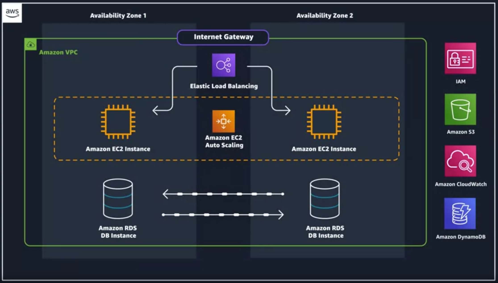
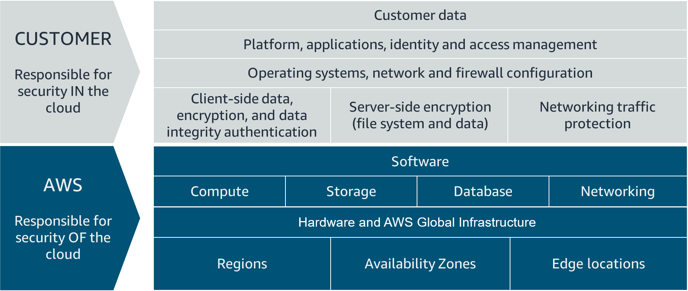

# Module 1

## Benefits of cloud computing
- pay as you go
- massive economies of scale
- stop guessing capacity
- increase speed and agility
- stop spending money running and maintaining data centers
- go global in minutes

## AWS global infrastructure
- AZ (availability zone) are cluster of data centers with redundant power, network and connectivity
- For further redundancy, the AZs are clustered, called altogether as regions. Regions are generally named after the real world places. Following considerations must be made to choose a region.
    - compliance : according to company policy, where should the data be located geographically on a data server
    - latency : how close your it resources are to user database.
    - pricing : some regions might be costlier than others.
    - service availability : whether the services are availability in the nearby region or not?

## Interacting with AWS
- three ways to interact with using APIs
    - aws management console : beginner friendly
    - aws command line interface : intermediate fiendly (either on local pc using an installed client or aws cloud shell)
    - aws software developement kits : advanced (e.g. C++, Go, Java, JavaScript, .NET, Node.js, PHP, Python, and Ruby.developers commonly use AWS SDKs to integrate their application source code with AWS services. )

## Security and the aws shared responsibility model
- both aws and customer are responsible
- aws is responsible for infrastructure and viztualisation for scurity **of** the cloud
- customer is responsible for security **in** the cloud

## protect the aws root user
- the signed-up email is the root user of the aws account
- need to make a hard-to-crack passowrd and MFA (multi-factor authentification)

## aws identity and access management
- we can allow authentification and authorisation. authorisation should be managed by the root user. here are a few IAM policies.
    - grant or deny permission to take actions
    - actions are aws api calls
    - attach **policies** to aws identities. IAM policies are json documents to configure the authorisation of a user, including the conditions. it can be assigned to users individually or the groups as well.
        - managed policies are pre-built policies (built either by AWS or by your administrators) that can be attached to IAM users and groups. When updated, all users and groups associated with the policy inherit the changes to that policy.
        - inline policy, a policy assigned to one discrete user or group, and typically used to apply permissions for one-off situations.
- The list below outlines the basic structure of an IAM policy:
    - Effect indicates whether to Allow or Deny the permissions.
    - Action specifies the API calls allowed to an AWS service (such as cloudwatch:ListMetrics).
    - Resource defines the scope of entities covered by the policy rule (i.e., a specific Amazon S3 bucket, Amazon EC2 instance, or \*, which indicates any resource).
- least privilege is a standard security principle that advises you to grant only the necessary permissions to do a particular job and nothing more. follow it.s

## aws iam roles
- iam roles have access key and secret keys to access a reousce
- maintaining roles is easier than maintaining users. When you assume a role, IAM dynamically provides temporary credentials that expire after a defined period of time, between 15 minutes and 36 hours. 
- use iam identity center if we have a large number of users accessing aws cloud
