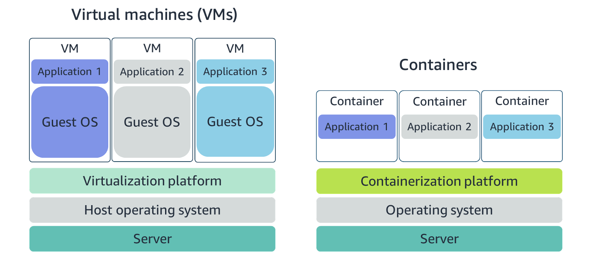
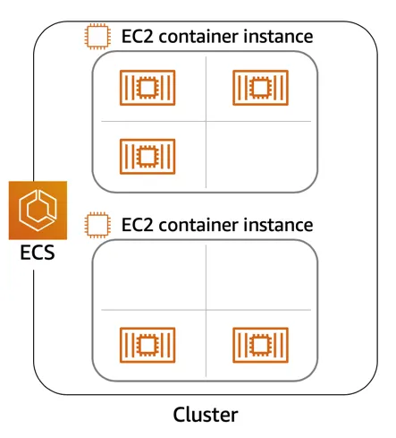
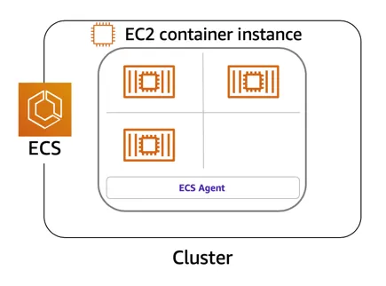
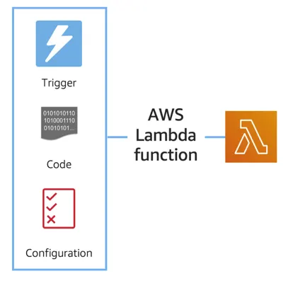
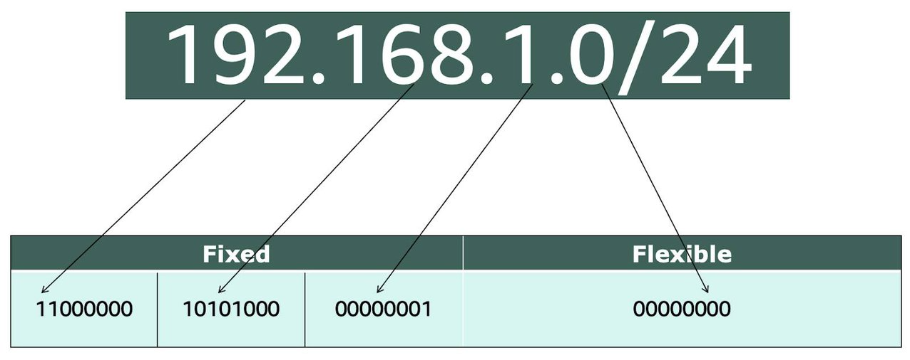
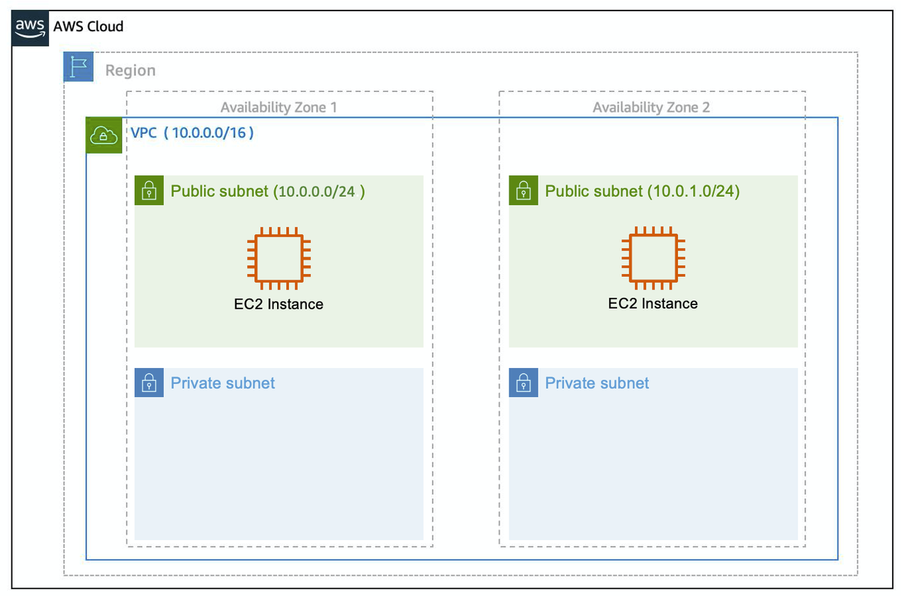
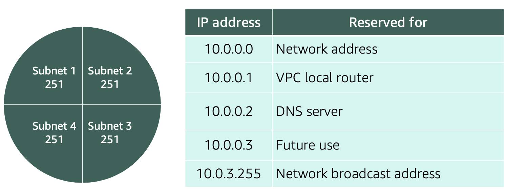
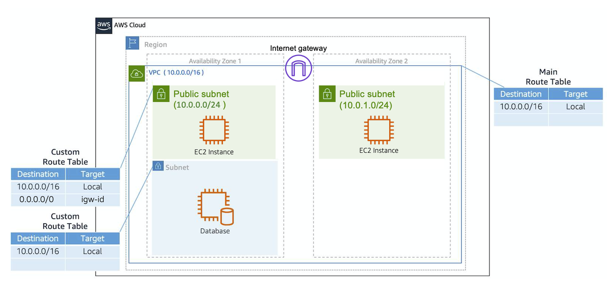
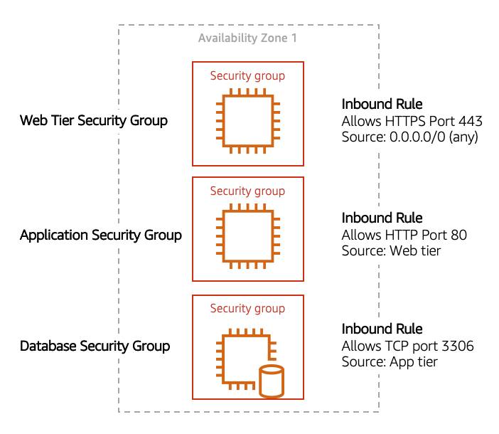

# Module 2

## Compute as a service of AWS
In AWS, these virtual machines are called Amazon Elastic Compute Cloud or Amazon EC2. Behind the scenes, AWS operates and manages the host machines and the hypervisor layer. AWS also installs the virtual machine operating system, called the guest operating system.

## Amazon Elastic compute cloud EC2
- Amazon EC2 is a web service that provides secure, resizable compute capacity in the cloud. It allows you to provision virtual servers called EC2 instances. 
- When launching an EC2 instance, the first setting you configure is which operating system you want by selecting an Amazon Machine Image (AMI).
- When you launch a new instance, AWS allocates a virtual machine that runs on a hypervisor. Then the AMI you selected is copied to the root device volume, which contains the image used to boot the volume. In the end, you get a server you can connect to and install packages and any additional software. 

## Amazon EC2 Instance Lifecycle
- Instance Families in table below

| Instance Family | Description | Use Cases  |
| -------- | ------- | ------- |
|  General purpose  |  Provides a balance of compute, memory, and networking resources, and can be used for a variety of workloads.    | Scale-out workloads such as web servers, containerized microservices, caching fleets, distributed data stores, and development environments. |
|  Compute optimized  |  Ideal for compute-bound applications that benefit from high-performance processors.    |  High-performance web servers, scientific modeling, batch processing, distributed analytics, high-performance computing (HPC), machine/deep learning, ad serving, highly scalable multiplayer gaming. |
|   Memory optimized  |  Designed to deliver fast performance for workloads that process large data sets in memory.   | Memory-intensive applications such as high-performance databases, distributed web-scale in-memory caches, mid-size in-memory databases, real-time big-data analytics, and other enterprise applications. |
|   Accelerated computing  |   Use hardware accelerators or co-processors to perform functions such as floating-point number calculations, graphics processing, or data pattern matching more efficiently than is possible with conventional CPUs.   | 3D visualizations, graphics-intensive remote workstations, 3D rendering, application streaming, video encoding, and other server-side graphics workloads. |
 |   Storage optimized  |  Designed for workloads that require high, sequential read and write access to large data sets on local storage. They are optimized to deliver tens of thousands of low-latency random I/O operations per second (IOPS) to applications that replicate their data across different instances.   | NoSQL databases, such as Cassandra, MongoDB, and Redis, in-memory databases, scale-out transactional databases, data warehousing, Elasticsearch, and analytics. |

- When architecting any application for high availability, consider using at least two EC2 instances in two separate Availability Zones. ­
- There are three main purchasing options for EC2 instances: on-demand, reserved, and spot instances. 
    - With On-Demand instances, you pay for compute capacity with no long-term commitments.
    - RIs provide a discounted hourly rate and an optional capacity reservation for EC2 instances.You can choose between three payment options: All Upfront, Partial Upfront, or No Upfront. You can select either a 1-year or 3-year term for each of these options.
    - With Spot Instances, you set a limit on how much you would like to pay for the instance hour. This is compared against the current Spot price that AWS determines. If the amount you pay is more than the current Spot price and there is capacity, then you will receive an instance. 
        - Because of this unique consideration, inherently fault-tolerant workloads are typically good candidates to use with Spot instances. These include big data, containerized workloads, continuous integration/continuous delivery (CI/CD), web servers, high-performance computing (HPC), image and media rendering, or other test and development workloads. 

## Container services on AWS
- A container is a standardized unit that packages up your code and all of its dependencies. This package is designed to run reliably on any platform, because the container creates its own independent environment.
- **Docker** is a popular container runtime that simplifies the management of the entire operating system stack needed for container isolation, including networking and storage. Docker makes it easy to create, package, deploy, and run containers.

- Containers share the same operating system and kernel as the host they exist on, whereas virtual machines contain their operating system. Since each virtual machine has to maintain a copy of an operating system, there’s a degree of wasted space.A container is more lightweight. 
- In AWS, containers run on EC2 instances.
- AWS offers two container orchestration services: Amazon Elastic Container Service (ECS) and Amazon Elastic Kubernetes Service (EKS)

- To run and manage your containers, you need to install the Amazon ECS Container Agent on your EC2 instances. An instance with the container agent installed is often called a container instance.

- To prepare your application to run on Amazon ECS, you create a task definition. The task definition is a text file, in JSON format, that describes one or more containers. A task definition is similar to a blueprint that describes the resources you need to run that container, such as CPU, memory, ports, images, storage, and networking information.
- Kubernetes is a portable, extensible, open source platform for managing containerized workloads and services.
    - An EC2 instance with the ECS Agent installed and configured is called a container instance. In Amazon EKS, it is called a worker node.
    - An ECS Container is called a task. In the Amazon EKS ecosystem, it is called a pod.
    - While Amazon ECS runs on AWS native technology, Amazon EKS runs on top of Kubernetes.

## Serverless and AWS Lambda
- Every definition of serverless mentions four aspects.
    - No servers to provision or manage.
    - Scales with usage.
    - You never pay for idle resources.
    - Availability and fault tolerance are built-in.
- AWS has several serverless compute options, including AWS Fargate and AWS Lambda.
- Amazon ECS and Amazon EKS enable you to run your containers in two modes.
    - Amazon EC2 mode
    - AWS Fargate mode
- If you want to deploy your workloads and applications without having to manage any EC2 instances or containers, you can use AWS Lambda.
- There are three primary components of a Lambda function: the trigger, code, and configuration.

## Networking on AWS
- Networking is how you connect computers around the world and allow them to communicate with one another.
- In the digital world, computers handle the delivery of messages. This is called routing.
- Just like each home has a mail address, each computer has an IP address.
- CIDR notation is a compressed way of specifying a range of IP addresses. Specifying a range determines how many IP addresses are available to you. 
    - It begins with a starting IP address and is separated by a forward slash (the “/” character) followed by a number. The number at the end specifies how many of the bits of the IP address are fixed. In this example, the first 24 bits of the IP address are fixed. The rest are flexible. 

    - The higher the number after the /, the smaller the number of IP addresses in your network. For example, a range of 192.168.1.0/24 is smaller than 192.168.1.0/16. 
- When working with networks in the AWS Cloud, you choose your network size by using CIDR notation. 
    - In AWS, the smallest IP range you can have is /28, which provides you 16 IP addresses. 
    - The largest IP range you can have is a /16, which provides you with 65,536 IP addresses.

## Introduction to Amazon VPC
- A VPC is an isolated network you create in the AWS cloud, similar to a traditional network in a data center. When you create a VPC, you need to choose three main things. 
    - The name of your VPC.
    - A Region for your VPC to live in. Each VPC spans multiple Availability Zones within the Region you choose.
    - A IP range for your VPC in CIDR notation. This determines the size of your network. Each VPC can have up to four /16 IP ranges.
- After you create your VPC, you need to create subnets inside of this network. Think of subnets as smaller networks inside your base network
- When you create a subnet, you need to choose three settings.
    - The VPC you want your subnet to live in, in this case VPC (10.0.0.0/16).
    - The Availability Zone you want your subnet to live in, in this case AZ1.
    - A CIDR block for your subnet, which must be a subset of the VPC CIDR block, in this case 10.0.0.0/24.

- For AWS to configure your VPC appropriately, AWS reserves five IP addresses in each subnet. These IP addresses are used for routing, Domain Name System (DNS), and network management.
    - For example, consider a VPC with the IP range 10.0.0.0/22. The VPC includes 1,024 total IP addresses. This is divided into four equal-sized subnets, each with a /24 IP range with 256 IP addresses. Out of each of those IP ranges, there are only 251 IP addresses that can be used because AWS reserves five.  

- To enable internet connectivity for your VPC, you need to create an internet gateway. After you create an internet gateway, you then need to attach it to your VPC.  
- A virtual private gateway allows you to connect your AWS VPC to another private network. Once you create and attach a VGW to a VPC, the gateway acts as anchor on the AWS side of the connection. Once you have both gateways, you can then establish an encrypted VPN connection between the two sides. 

## Amazon VPC Routing and Security
- When you create a VPC, AWS creates a route table called the main route table. A route table contains a set of rules, called routes, that are used to determine where network traffic is directed. 
    - the default configuration of the main route table is to allow traffic between all subnets in the local network.
- There are two main parts to this route table.
    - The destination, which is a range of IP addresses where you want your traffic to go.
    - The target, which is the connection through which to send the traffic. 

- A network ACL enables you to control what kind of traffic is allowed to enter or leave your subnet. You can configure this by setting up rules that define what you want to filter. 
- The default network ACL allows all traffic in and out of your subnet.
- Network ACL’s are considered stateless, so you need to include both the inbound and outbound ports used for the protocol. If you don’t include the outbound range, your server would respond but the traffic would never leave the subnet.
- security groups are stateful, meaning they will remember if a connection is originally initiated by the EC2 instance or from the outside and temporarily allow traffic to respond without having to modify the inbound rules.
    - If you want your EC2 instance to accept traffic from the internet, you’ll need to open up inbound ports. If you have a web server, you may need to accept HTTP and HTTPS requests to allow that type of traffic in through your security group. You can create an inbound rule that will allow port 80 (HTTP) and port 443 (HTTPS) as shown below.

## Common network troubleshooting steps for Amazon VPC
In the demos throughout this course, you will see the Employee Directory Application being launched onto a Amazon EC2 instance that is placed in a public subnet in an Amazon VPC. There are multiple networking configurations that play into whether an instance is accessible to the internet or not.

Below we will run down a list of configurations you should check if you ever have a public EC2 instance with a web application that is not loading as expected.

1. Internet gateway

Ensure that an Internet Gateway (IGW) is attached to your VPC. Without the internet gateway, no traffic will be allowed in or out of the VPC.

2. Route tables

Check the route table associated with the subnet of your EC2 instance. Ensure there is a route with a destination of 0.0.0.0/0 that points to the Internet Gateway. This route allows outbound traffic to the internet.

3. Security groups

Review the security group settings attached to your EC2 instance. Make sure there are inbound rules allowing HTTP (port 80) and/or HTTPS (port 443) traffic from the internet (0.0.0.0/0). Also, verify that outbound rules allow traffic to leave the instance.

4. Network Access Control Lists

Check the NACLs associated with your subnet. Ensure that they allow inbound and outbound traffic for HTTP and HTTPS. Unlike security groups, NACLs are stateless, so you must explicitly allow both inbound and outbound rules.

5. Public IP address

Ensure your EC2 instance has a public IP address assigned. You can check this in the EC2 console under the instance details. If it does not have a public IP, relaunch the instance and ensure you have the configuration for assigning a public IP address set correctly.

6. HTTP vs HTTPS

Confirm that your application is accessible via the correct protocol. If your application is configured for HTTPS, ensure SSL/TLS certificates are correctly installed and configured. Also, check if the web browser is trying to connect via the wrong protocol (HTTP instead of HTTPS or vice versa). For this course, the application is operating via HTTP, double check that your browser is not trying to connect via HTTPS. You can do this by selecting the address bar in the browser and making sure the address starts with http and not https.

7. User data script

If your instance uses a user data script to configure the application on launch, verify that the script has run successfully. Check the instance logs (/var/log/cloud-init.log or /var/log/cloud-init-output.log) for any errors that may have occurred during the execution of the user data script.

8. Permissions

Verify the permissions and roles attached to your EC2 instance. Ensure the instance has the necessary IAM roles and policies to access any required AWS services, such as S3, DynamoDB, or RDS.

9. Personal network permissions

Ensure that your personal or corporate network does not have restrictions blocking access to the public IP address of your EC2 instance. Some networks might have firewalls or proxy settings that could block outbound traffic to certain IP ranges or ports.

10. Application 

Ensure that your application code is correctly deployed and running. Check the application's logs to diagnose any runtime errors. Also, make sure the web server (e.g., Apache, Nginx) is installed and running.

