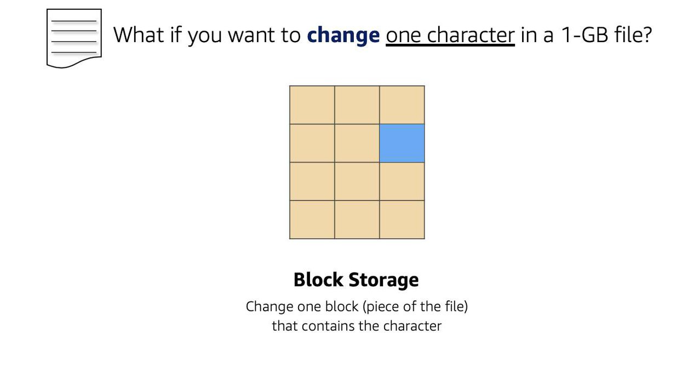
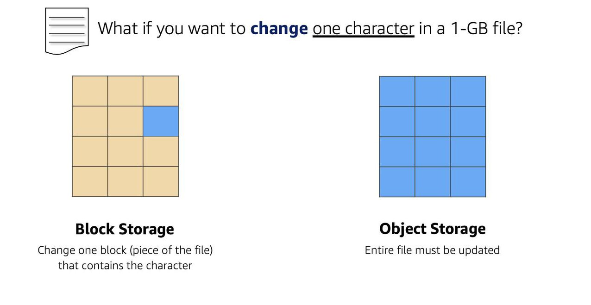
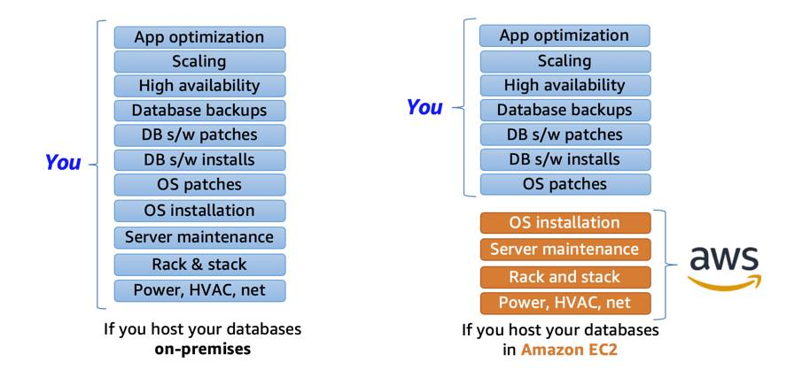
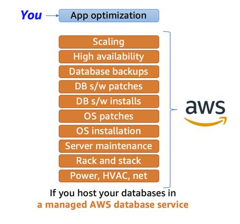
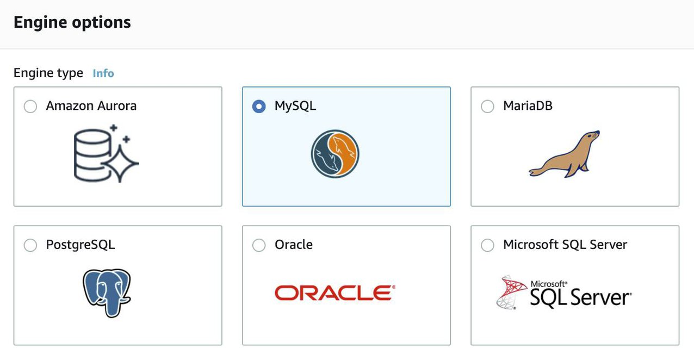
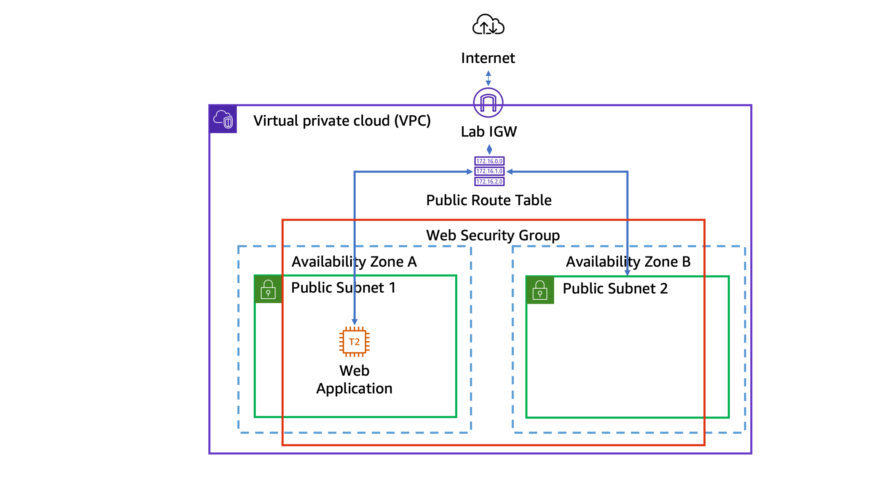

# Module 3

## Storage Types on AWS
- While file storage treats files as a singular unit, block storage splits files into fixed-size chunks of data called blocks that have their own addresses. Since each block is addressable, blocks can be retrieved efficiently.
    - Since block storage is optimized for low-latency operations, it is a typical storage choice for high-performance enterprise workloads, such as databases or enterprise resource planning (ERP) systems, that require low-latency storage.

- Objects, much like files, are also treated as a single unit of data when stored. However, unlike file storage, these objects are stored in a flat structure instead of a hierarchy. 
    -  Object storage is generally useful when storing large data sets, unstructured files like media assets, and static assets, such as photos.

## Amazon EC2 Instance Storage and Amazon Elastic Block Store
- Amazon EC2 Instance Store provides temporary block-level storage for your instance, just like RAM
- Amazon EBS is a block-level storage device that you can attach to an Amazon EC2 instance.
- You can detach an EBS volume from one EC2 instance and attach it to another EC2 instance in the same Availability Zone, to access the data on it.
- For EBS volumes, the maximum amount of storage you can have is 16 TB. it is scalable.
- EC2 has a one-to-many relationship with EBS volumes. You can add these additional volumes during or after EC2 instance creation to provide more storage capacity for your hosts.
- Amazon EBS is useful when you need to retrieve data quickly and have data persist long-term. 

|  | EBS Provisioned IOPS SSD | EBS General Purpose SSD  | Throughput Optimized HDD  | Cold HDD |
| -------- | ------- | ------- | ------- | ------- |
| Description | Highest performance SSD designed for latency-sensitive transactional workloads | General purpose SSD that balances price and performance for a wide variety of transactional workloads |  Low-cost HDD designed for frequently accessed, throughput intensive workloads |  Lowest cost HDD designed for less frequently accessed workloads |
| Use Cases | I/O-intensive NoSQL and relational databases |  Boot volumes, low-latency interactive apps, development, and test | Big data, data warehouses, log processing | Colder data requiring fewer scans per day |
| Volume Size | 4 GB-16 TB | 1 GB-16 TB | 500 GB-16 TB | 500 GB-16 TB |
| Max IOPS/Volume | 64,000 | 16,000 | 500 | 250 |
| Max Throughput/Volume | 1,000 MB/s | 250 MB/s | 500 MB/s | 250 MB/s |

- EBS snapshots are incremental backups that only save the blocks on the volume that have changed after your most recent snapshot. 

## Object Storage with Amazon S3
-  Amazon EBS, Amazon S3 is a standalone storage solution that isn’t tied to compute. It enables you to retrieve your data from anywhere on the web.
- Amazon S3 is an object storage service. Object storage stores data in a flat structure, using unique identifiers to look up objects when requested. An object is simply a file combined with metadata and that you can store as many of these objects as you’d like. All of these characteristics of object storage are also characteristics of Amazon S3. 
- In Amazon S3, you have to store your objects in containers called buckets. 
- Amazon S3 is useful for backup and storeage, media hosting, software delivery,data lakes, static websites and static content
- By default, everything is private on amazon s3. Howerver, we can set the IAM policies, s3 policies or ACLs to make certain data public.
-  You use S3 versioning! Versioning enables you to keep multiple versions of a single object in the same bucket, however it increments the storage cost.
- Following are some storage classes of aws S3
    - **Amazon S3 Standard:** This is considered general purpose storage for cloud applications, dynamic websites, content distribution, mobile and gaming applications, and big data analytics.
    - **Amazon S3 Intelligent-Tiering:** This tier is useful if your data has unknown or changing access patterns. S3 Intelligent-Tiering stores objects in two tiers, a frequent access tier and an infrequent access tier. Amazon S3 monitors access patterns of your data, and automatically moves your data to the most cost-effective storage tier based on frequency of access.
    - **Amazon S3 Standard-Infrequent Access (S3 Standard-IA):** S3 Standard-IA is for data that is accessed less frequently, but requires rapid access when needed. S3 Standard-IA offers the high durability, high throughput, and low latency of S3 Standard, with a low per-GB storage price and per-GB retrieval fee. This storage tier is ideal if you want to store long-term backups, disaster recovery files, and so on.
    - **Amazon S3 One Zone-Infrequent Access (S3 One Zone-IA):** Unlike other S3 storage classes which store data in a minimum of three Availability Zones (AZs), S3 One Zone-IA stores data in a single AZ and costs 20% less than S3 Standard-IA. S3 One Zone-IA is ideal for customers who want a lower-cost option for infrequently accessed data but do not require the availability and resilience of S3 Standard or S3 Standard-IA. It’s a good choice for storing secondary backup copies of on-premises data or easily re-creatable data.
    - **Amazon S3 Glacier Instant Retrieval:** Amazon S3 Glacier Instant Retrieval is an archive storage class that delivers the lowest-cost storage for long-lived data that is rarely accessed and requires retrieval in milliseconds.
    - **Amazon S3 Glacier Flexible Retrieval:** S3 Glacier Flexible Retrieval delivers low-cost storage, up to 10% lower cost (than S3 Glacier Instant Retrieval), for archive data that is accessed 1—2 times per year and is retrieved asynchronously.
    - **Amazon S3 Glacier Deep Archive:** S3 Glacier Deep Archive is Amazon S3’s lowest-cost storage class and supports long-term retention and digital preservation for data that may be accessed once or twice in a year. It is designed for customers—particularly those in highly regulated industries, such as the Financial Services, Healthcare, and Public Sectors—that retain data sets for 7 to 10 years or longer to meet regulatory compliance requirements.
    - **Amazon S3 Outposts:** Amazon S3 on Outposts delivers object storage to your on-premises AWS Outposts environment.
- **Amazon S3 works great with EC2 and Lambda**
- **tempory data should be on ec2 instance store**

## Choose the Right Storage Service
- EC2 Instance store is ephemeral block storage.
    - This is preconfigured storage that exists on the same physical server that hosts the EC2 instance and cannot be detached from Amazon EC2.
- Amazon EBS is meant for data that changes frequently and needs to persist through instance stops, terminations, or hardware failures. 
- If your data doesn’t change that often, Amazon S3 might be a more cost-effective and scalable storage solution. 

## Explore Databases on AWS
- A relational database organizes data into tables. Data in one table can be linked to data in other tables to create relationships—hence, the relational part of the name.
- The tables, rows, columns, and relationships between them is referred to as a logical schema.
- A relational database management system (RDBMS) lets you create, update, and administer a relational database. 

**unmanaged_database**

**managed_database**

## Amazon Relational Database Service

- The cloud native option, Amazon Aurora, is a MySQL and PostgreSQL-compatible database built for the cloud. It is more durable, more available, and provides faster performance than the Amazon RDS version of MySQL and PostgreSQL.
- Much like a regular EC2 instance, the DB instance uses Amazon Elastic Block Store (EBS) volumes as its storage layer. 
- When you create a DB instance, you select the Amazon Virtual Private Cloud (VPC) that your databases will live in. Then, you select the subnets that you want the DB instances to be placed in. This is referred to as a DB subnet group.
- Network ACLs and security groups allow you to dictate the flow of traffic. If you want to restrict what actions and resources your employees can access, you can use IAM policies.
- You can retain your automated backups between 0 and 35 days.
- Point-in-time recovery creates a new DB instance using data restored from a specific point in time. This restoration method provides more granularity by restoring the full backup and rolling back transactions up to the specified time range.  
- If you want to keep your automated backups longer than 35 days, use manual snapshots. 
- When you enable Amazon RDS Multi-AZ, Amazon RDS creates a redundant copy of your database in another AZ. You end up with two copies of your database: a primary copy in a subnet in one AZ and a standby copy in a subnet in a second AZ.   

## Choose the Right AWS Database Service
| Database Type | Use Cases | AWS Service |
| -------- | ------- | ------- |
| Relational | Traditional applications, ERP, CRM, e-commerce | Amazon RDS, Amazon Aurora, Amazon Redshift |
| Key-value | High-traffic web apps, e-commerce systems, gaming applications | Amazon DynamoDB |
| In-memory | Caching, session management, gaming leaderboards, geospatial applications | Amazon ElastiCache for Memcached, Amazon ElastiCache for Redis |
| Document | Content management, catalogs, user profiles | Amazon DocumentDB (with MongoDB compatibility) |
| Wide column | High-scale industrial apps for equipment maintenance, fleet management, and route optimization | Amazon Keyspaces (for Apache Cassandra) |
| Graph | Fraud detection, social networking, recommendation engines | Amazon Neptune |
| Time series | IoT applications, DevOps, industrial telemetry |Amazon Timestream |
| Ledger | Systems of record, supply chain, registrations, banking transactions | Amazon QLDB |

## lab-3-overview

