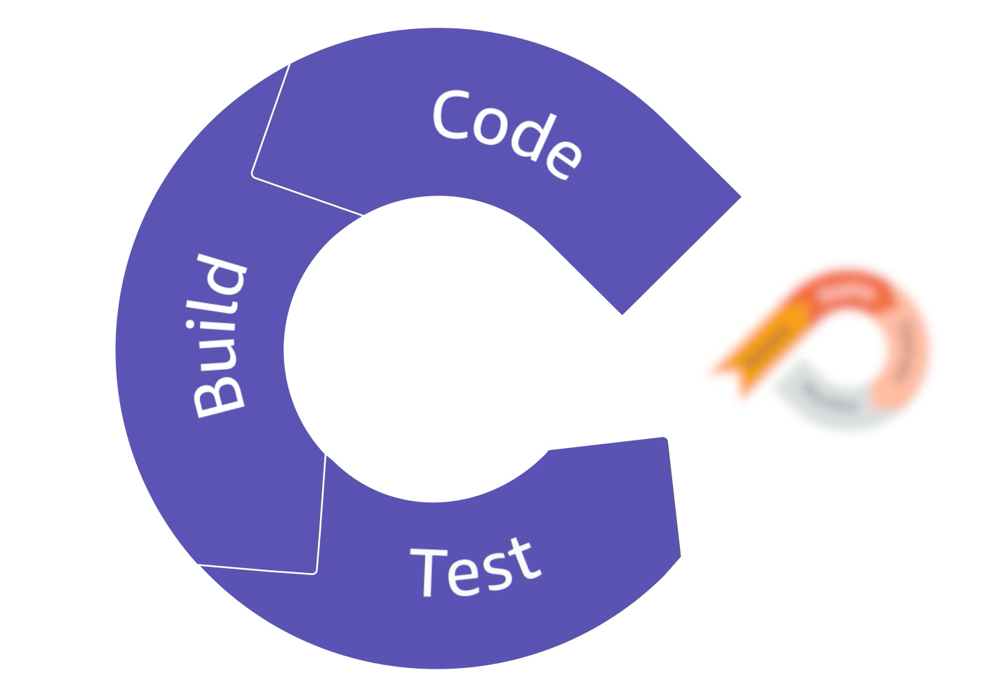
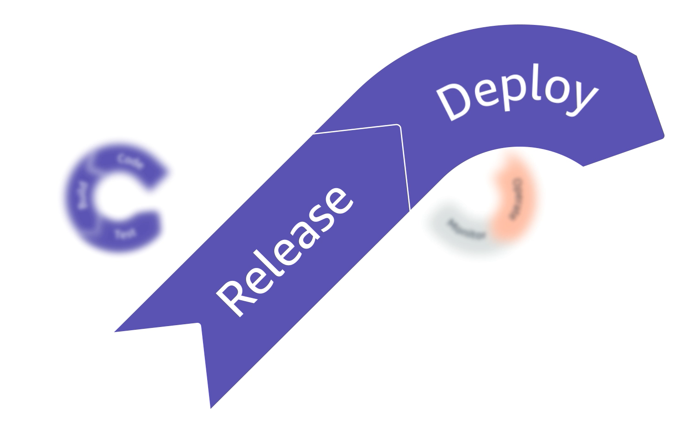

# Module 1

## Recap from the Previous Courses
Thank you for joining us for Course 3 in our DevOps Series, focusing on Operate and Monitor. This reading provides a recap of the previous two courses that are in this series. Both courses focused on processes and practices you would use in a software development team.

1. DevOps on AWS: Code, Build, and Test

The first course focused on the continuous integration aspects of the DevOps journey. This course covered the first three steps of the DevOps loop through lectures, demonstrations, and hand-on exercises about services like AWS CodeCommit, AWS CodeBuild, and AWS CodePipeline. Here is a brief explanation of each step:

Code
AWS CodeCommit
 is a secure, highly scalable, managed source control service that hosts private Git repositories. It makes it easy for teams to securely collaborate on code, with contributions encrypted in transit and at rest. CodeCommit reduces the need for you to manage your own source-control system or worry about scaling its infrastructure.

Build
AWS CodeBuild
 is a fully managed continuous integration service that compiles source code, runs tests, and produces software packages that are ready to deploy. You don’t need to provision, manage, and scale your own build servers. CodeBuild scales near continuously and can process multiple builds concurrently.

Test
AWS CodePipeline
 is a fully managed service that helps you automate your release pipelines for fast and reliable application and infrastructure updates so that you can deliver features and updates  rapidly and reliably. For context, in the first course, CodePipeline was used to test the build before incrementing a continuous delivery pipeline.

2. DevOps on AWS: Release and Deploy
The second course focused on infrastructure as code, and how to start evolving continuous integration into a continuous delivery model. With continuous delivery, you can push features into environments and manage infrastructure with the help of AWS CloudFormation.

Release
AWS CloudFormation
 gives you a way to model a collection of related AWS and third-party resources, provision them quickly and consistently, and manage them throughout their lifecycles by treating infrastructure as code.

Deploy
AWS CodeDeploy
 automates code deployments to any instance, including Amazon Elastic Compute Cloud (Amazon EC2) instances and on-premises servers. AWS CodeDeploy makes it easier for you to rapidly release new features, helps you avoid downtime during application deployment, and handles the complexity of updating your applications.

Note: The exercises on this course do not build on the exercises you might have worked on in the previous two courses. If  you didn’t complete the labs from the previous courses before starting this course, it isn’t a blocker on your DevOps journey!

## The Importance of Monitoring on CI/CD, and AWS Services Used Towards It
The core principle of agile and DevOps is the continuous delivery of value. By architecting and building continuous integration and continuous delivery (CI/CD) pipelines, development teams can automate the process and ensure quality and safety for continuous compliance.

CI/CD is at the core of any DevOps practice, combining the processes and tooling that move code changes through the application delivery pipeline. Implementing CI/CD can unlock a competitive advantage for your business, helping you resolve issues faster, reduce time to market, and increase employee and customer satisfaction.

Amazon CloudWatch is a monitoring and observability service built for DevOps engineers, developers, site reliability engineers (SREs), and IT managers. CloudWatch provides you with data and actionable insights to monitor your applications, respond to system-wide performance changes, optimize resource utilization, and get a unified view of operational health.

Benefits of CloudWatch

Observability on a single platform across applications and infrastructure

Easiest way to collect metrics in AWS and on-premises

Improve operational performance and resource optimization

Get operational visibility and insight

Derive actionable insights from logs

In addition to Amazon CloudWatch metrics, alarms and dashboards, you can also use a service called 
Amazon Managed Service for Grafana (AMG)
. Grafana is a widely deployed data visualization tool that is popular for its extensible data support, and AMG is a fully managed and secure data visualization service. You can use AMG to instantly query, correlate, and visualize operational metrics, logs, and traces from multiple sources. AMG makes it easy to deploy, operate, and scale Grafana.

Depending on your case or usage, you might already use another service for monitoring and reporting. There are good monitoring and reporting services in the market, and even some open-source services. Make sure to explore every possibility and choose the one that best suits your needs. Remember that the most important part is not which service you use for monitoring: it’s having a way to monitor your systems and be notified about potential issues. As Raf said in one of the videos, operating your infrastructure without monitoring is similar to flying an airplane with no instruments!

## Preventive and Corrective Actions, Driven by Your Ability to Monitor
As you learned in this course, monitoring is a key component of DevOps. Monitoring involves collecting metrics and data by automating and instrumentalizing your application’s performance and usage. Because DevOps is a continuous cycle, monitoring isn’t limited to only the deployed production application—you can apply monitoring across the entire DevOps life cycle to further improve your release, deployment, and testing processes. Without monitoring, you wouldn’t be able to track metrics, gather data, analyze the metrics and data for insights, or apply the insights you gain to your application. And with many AWS services, monitoring mechanisms (such as logs, alerts, and the like) are either built into the service itself or provided through other services, like Amazon CloudWatch or AWS CloudTrail. 

But what value does monitoring bring to you, as a developer? In business, changes—in the needs of your customers, the market, the business environment, application security, government regulations, and many other areas—are a constant. By using DevOps methodology, you can adapt and even transform your application to address these changes. However, your ability to respond quickly and act proactively to all these changes relies on metrics and data about your application, and the insights you can gain from that data.

As an example, here’s a simple scenario: your team has just deployed a new application to production. Imagine that your team isn’t monitoring the application’s performance or usage. If a problem occurs—say, a server goes down and no failover plan is in place—you might first learn about this issue through customer reports that the support team forwards to you. Before you could take corrective action, you would need to search through multiple sources of information to understand the conditions that resulted in the server failure. And while you are working to resolve the situation, the application remains non-functional, and more customer reports about the application outage continue to come in. Responding to application issues only in a reactive way can be costly in terms of time and resources, and it’s not an ideal situation.

Now, imagine that your team has some basic monitoring mechanisms in place. Though you can use the monitoring tools to correct issues as they occur, monitoring can be used in a preventive way—that is, to prevent issues before they occur. Your team set up some basic instruments to monitor your application servers, such as server utilization metrics, alarms for traffic spikes, different types of logs, and automated notifications to alert you to certain conditions. Adding these instruments helped your application operate more smoothly. You are now alerted when server utilization reaches a critical level (for example, 80%). You can configure the server instances to automatically scale out when a certain utilization threshold is reached, and to scale in when the server utilization decreases to a certain percentage. By monitoring the application and automating how your application responds to monitoring events, you can take preventive action to handle server load before it becomes a problem for your application.

Preventive actions extend to tracking overall application and system health, including data analytics. With monitoring instruments in place, you can capture operational data over a period of time. This data can establish performance baselines for your application, which can surface unusual behavior and other anomalies. Adding a visualization layer to your application’s monitoring data can help you identify trends, gain more insight, and help with troubleshooting your application. If you want to learn more about data analytics on AWS, we also offer another data analytics course on this platform: 
Getting Started with Data Analytics on AWS
.

As an example, return to previous scenario. The monitoring instruments have been collecting data for a few months, and your team added some visualization tools to help you interpret the data coming in from the logs and metrics. You notice that there’s a cyclical daily increase in application usage that lasts for a couple of hours before it returns to a lower, baseline level. One day, an unusual surge of traffic sets off an alarm notification. You know that the traffic surge is taking place outside of the usual daily peak. Based on the patterns that you see in the visualization dashboard, you suspect that a distributed denial of service (DDoS) event might be taking place, and you can then make sure that your mitigation plan is underway. Your instruments give you visibility into the health of your application, and in turn, you can analyze that data to troubleshoot and optimize your application and continuous integration and continuous delivery (CI/CD) pipelines.

You could further automate the monitoring and operationalizing of your CI/CD pipeline through machine learning (ML). Using ML on monitoring data is a growing trend in DevOps. With ML, you can have an automated way to extract insights from all your monitoring data from all your resources. By doing so, you can identify possible issues, correlate them across multiple services, and remediate them before they cause a problem for your users. A DevOps ML solution could provide more visibility into the operational health of the entire system. 

AWS offers an ML service for DevOps. Amazon DevOps Guru is a fully managed service that uses ML to monitor and analyze your operational data in a near-continuous way. Using machine learning models that are informed by years of operational data from Amazon, DevOps Guru produces insights, which are a collection of anomalies (unexpected or unusual metrics) that it identifies during its analysis. Insights can be reactive (reported as they occur) or predictive (reported before the unusual behavior occurs). DevOps Guru also provides recommendations for each insight that suggest how you could improve the performance of your application. 

## 